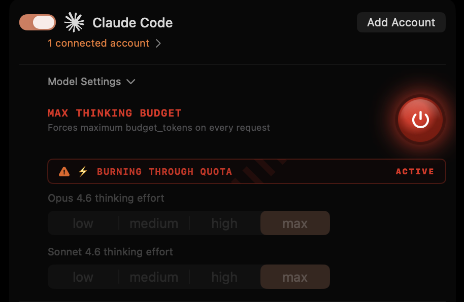

# DroidProxyPlus

<p align="center">
  
</p>

A native macOS menu bar app that proxies Claude Code and Codex authentication for use with AI coding tools like [](https://app.factory.ai) Droids. Built on [CLIProxyAPIPlus](https://github.com/router-for-me/CLIProxyAPIPlus).

## Download

Grab the latest release from [Releases](https://github.com/KilimcininKorOglu/droidproxyplus/releases/latest):

- **DroidProxyPlus-arm64.zip** -- Apple Silicon (M1/M2/M3/M4)

All releases are code-signed and notarized by Apple. Existing installs auto-update via Sparkle.

## Features

- **One-click OAuth auth** -- Claude Code and Codex login from the menu bar, credential monitoring, auto-refresh
- **Adaptive thinking proxy** -- Injects `thinking: {"type":"adaptive"}` and per-model `output_config.effort` for Claude Opus 4.6 and Claude Sonnet 4.6 requests sent through `http://localhost:8317`
- **Codex reasoning controls** -- Injects `reasoning: {"effort":"..."}` for `gpt-5.3-codex` and `gpt-5.4` via the OpenAI-compatible `http://localhost:8317/v1` endpoint
- **Per-model effort controls** -- Configure Opus 4.6 (`low` / `medium` / `high` / `max`), Sonnet 4.6 (`low` / `medium` / `high`), GPT 5.3 Codex (`low` / `medium` / `high` / `xhigh`), and GPT 5.4 (`low` / `medium` / `high` / `xhigh`) directly from the Settings window
- **Custom Model Manager** -- Add, edit, delete, import, and export Factory custom models from a dedicated manager window
- **Max Budget Mode** -- Forces maximum `budget_tokens` on every Claude request, engaging full thinking power at the cost of burning through your API quota

<p align="center">
  
</p>

- **Sparkle auto-updates** -- Checks daily, installs in the background
- **Factory integration** -- Use Claude models against `http://localhost:8317` and Codex/OpenAI models against `http://localhost:8317/v1`

## Setup

See [SETUP.md](SETUP.md) for authentication and Factory configuration instructions.

## Requirements

- macOS 13.0+ (Ventura or later)
- Apple Silicon (M1/M2/M3/M4)

## Build from source

```bash
# Debug build
cd src && swift build

# Release build + signed .app bundle
./create-app-bundle.sh
```

## Project Structure

```
src/
├── Sources/
│   ├── main.swift                    # App entry point
│   ├── AppDelegate.swift             # Menu bar & window management
│   ├── ServerManager.swift           # Server process control & auth
│   ├── SettingsView.swift            # Main settings UI
│   ├── AuthStatus.swift              # Auth file monitoring
│   ├── ThinkingProxy.swift           # Thinking parameter injection proxy
│   ├── AppPreferences.swift          # UserDefaults-backed preferences
│   ├── FactoryConfigManager.swift    # Factory settings.json I/O & CRUD
│   ├── CustomModelManagerView.swift  # Custom Model Manager window
│   ├── TunnelManager.swift           # Network tunnel management
│   ├── IconCatalog.swift             # Icon loading & caching
│   ├── LogoView.swift                # Factory.ai logo view
│   ├── NotificationNames.swift       # Notification constants
│   └── Resources/
│       ├── cli-proxy-api-plus        # CLIProxyAPIPlus binary
│       ├── config.yaml               # Server config
│       ├── AppIcon.icns              # App icon
│       ├── icon-active.png           # Menu bar icon (active)
│       ├── icon-inactive.png         # Menu bar icon (inactive)
│       ├── icon-claude.png           # Claude service icon
│       └── icon-codex.png            # Codex service icon
├── Package.swift
└── Info.plist
```

## Star History

<a href="https://starchart.cc/KilimcininKorOglu/droidproxyplus">
  <picture>
    <source media="(prefers-color-scheme: dark)" srcset="https://starchart.cc/KilimcininKorOglu/droidproxyplus.svg?theme=dark">
    
  </picture>
</a>

## License

MIT
